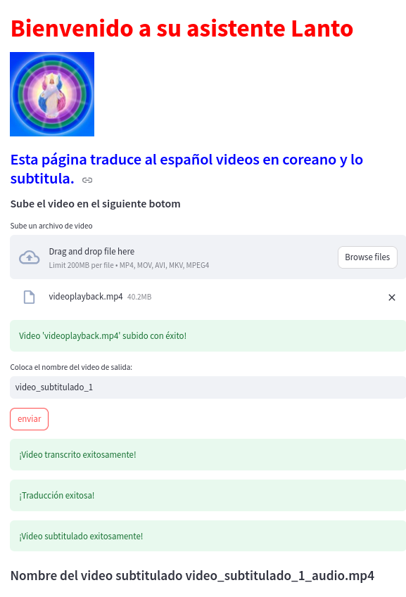
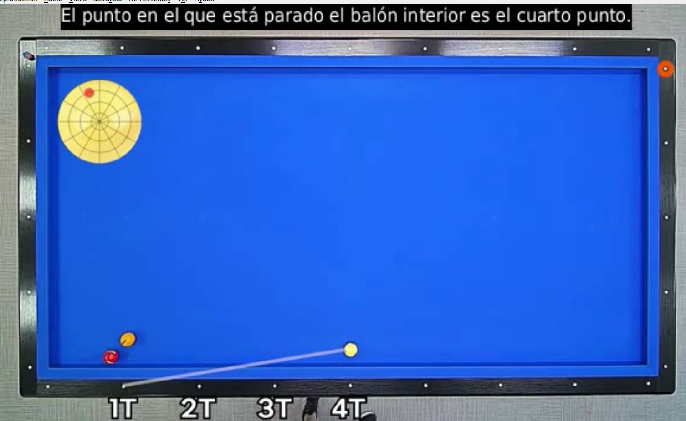

README: Aplicación de Traducción Automática
Descripción
Esta aplicación combina las capacidades de modelos avanzados de procesamiento de lenguaje natural y visión por computadora para realizar traducciones automáticas. Utiliza Whisper para transcripción de audio, LangChain para el manejo de flujos de datos, Llama 3.2 de Ollama para generación de texto, y Streamlit para proporcionar una interfaz web. Las librerías OpenCV y Pillow se usan para el manejo de imágenes y procesamiento multimedia.

Características
Transcripción de audio: Extrae texto de archivos de audio utilizando Whisper.
Traducción automática: Traduce el texto transcrito a través de Llama 3.2.
Procesamiento multimedia: Soporte para visualización de imágenes y contenido procesado con OpenCV y Pillow.
Interfaz amigable: Interfaz de usuario desarrollada con Streamlit, accesible vía navegador web.

